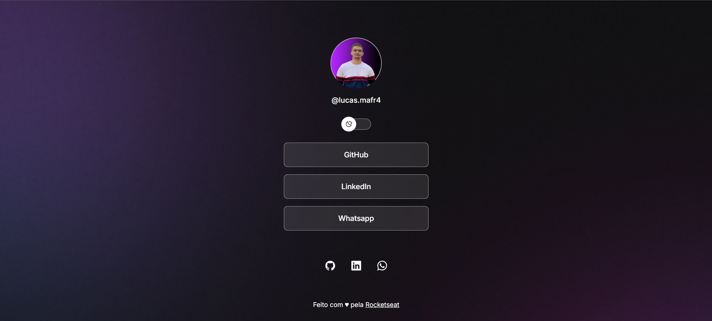

# 👥 Social-Project

Simple and responsive application that displays a social media website interface (clone or mockup).

This project was developed as HTML and CSS training, focusing on semantic structure, responsiveness, and best styling practices.

---

## 🖼️ Demo

👉 [Access the project online](https://brrn91.github.io/projeto-social/)

---

## 🛠️ Technologies Used

- **HTML5** (semantic structure)
- **CSS3** (styling and responsiveness)
- **Flexbox** for layout organization
- Custom font via **Google Fonts** or default system

---

## ⚙️ Features

- ✅ Responsive layout for different devices (desktop / tablet / mobile)
- ✅ Navigation menus
- ✅ Use of HTML semantics for better accessibility
- ✅ Clean, organized code, with good CSS practices (classes) reusable, CSS variables, etc.)

---

💡 **Note:** This project is part of my learning and portfolio. Feedback and suggestions are welcome! 😊

---

👨‍💻 Developed by [Brrn91](https://github.com/Brrn91)

💡Credits: [Rocketseat](https://app.rocketseat.com.br/)
